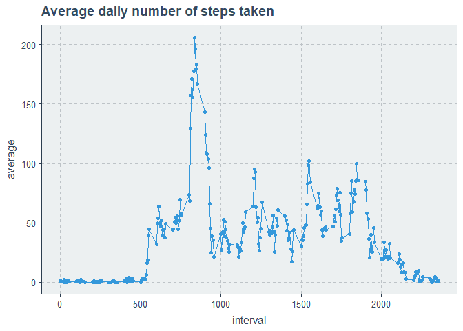
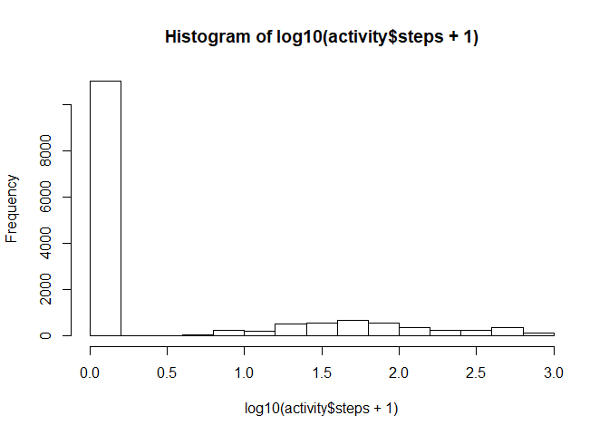
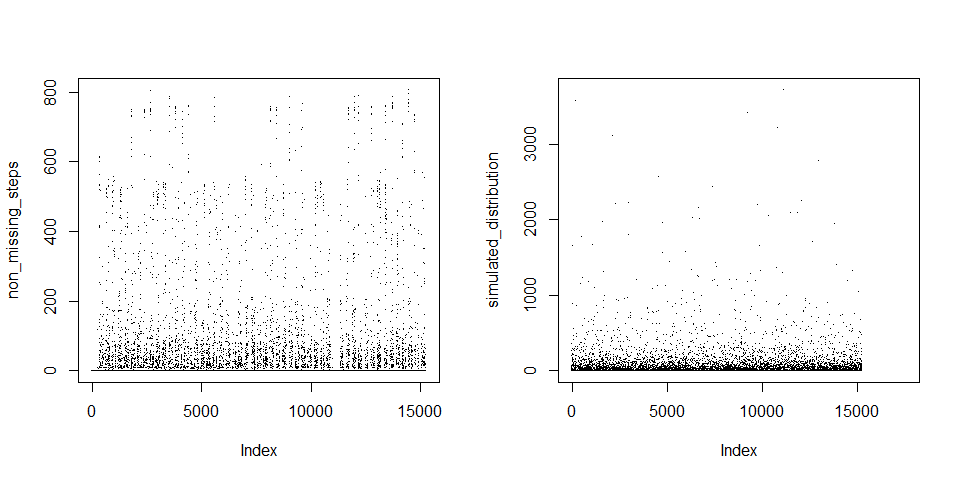
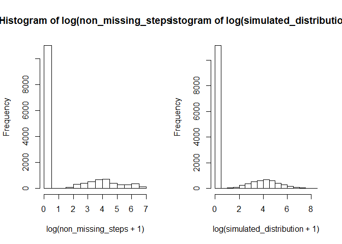
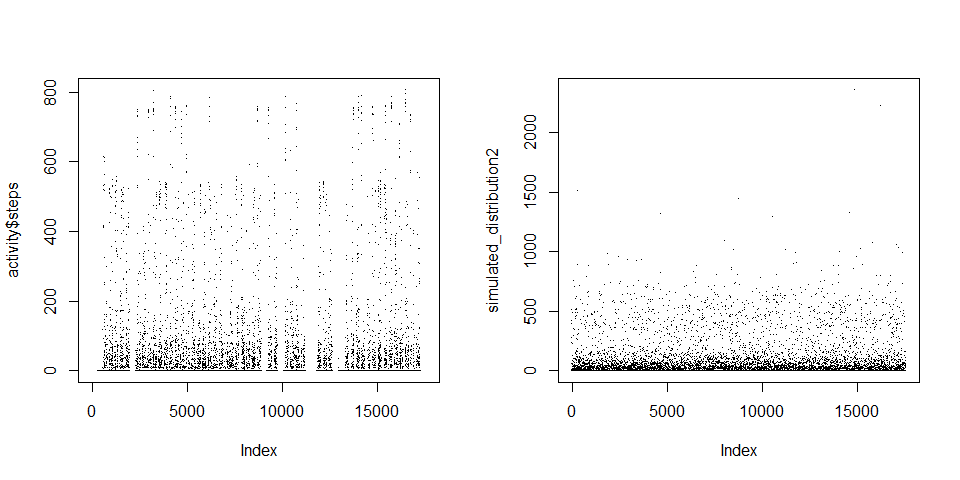
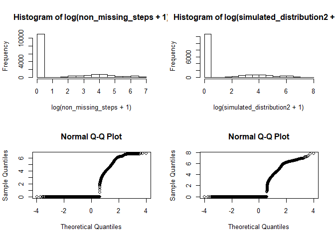
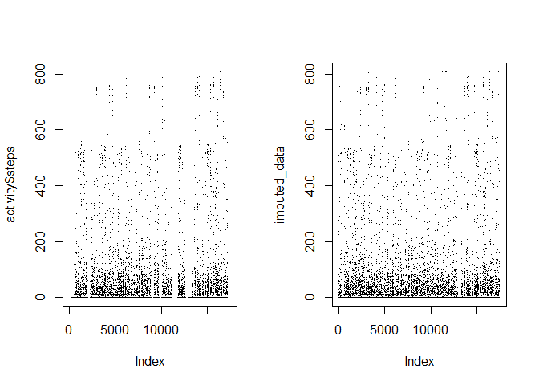
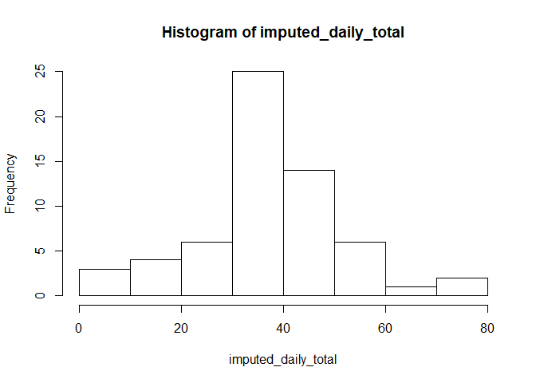

## Data preprocessing

### Downloading the data

Just as the professor said in the lectures, it is a good idea to have the source of our data included in the code, for
reproducibility.

First, we need to check if the steps have been done before, and, if not, create a little folder where our data will go:


```r
library(knitr)
opts_chunk$set(echo = TRUE)

if (!dir.exists("first_assignment")) {
    dir.create("first_assignment")
}
```

Then, we download the data,


```r
file_url <- "https://d396qusza40orc.cloudfront.net/repdata%2Fdata%2Factivity.zip"
if (!file.exists("first_assignment/activity_data.zip")) {
    download.file(file_url,
                  destfile = "first_assignment/activity_data.zip")
}
```

And unzip it if necessary:


```r
if (!file.exists("first_assignment/activity.csv")) {
    unzip("first_assignment/activity_data.zip", exdir = "first_assignment")
}
```

## Reading the data

Once our data has been downloaded appropriately, it is time to load it into R. 


```r
library(tidyverse)
```

```
## -- Attaching packages ----------------------------------------------------------------------------------------------------- tidyverse 1.3.0 --
```

```
## v ggplot2 3.3.0     v purrr   0.3.3
## v tibble  2.1.3     v dplyr   0.8.4
## v tidyr   1.0.2     v stringr 1.4.0
## v readr   1.3.1     v forcats 0.5.0
```

```
## -- Conflicts -------------------------------------------------------------------------------------------------------- tidyverse_conflicts() --
## x dplyr::filter() masks stats::filter()
## x dplyr::lag()    masks stats::lag()
```

```r
library(ggthemr)

activity <- read.csv('first_assignment/activity.csv')
```

We have a very long dataset of 17568 rows and 3 columns. Before doing any complex calculations,
it is always a good idea to do a sanity check on the data. Sometimes a simple str() and missing values check suffices.


```r
print(str(activity))
```

```
## 'data.frame':	17568 obs. of  3 variables:
##  $ steps   : int  NA NA NA NA NA NA NA NA NA NA ...
##  $ date    : Factor w/ 61 levels "2012-10-01","2012-10-02",..: 1 1 1 1 1 1 1 1 1 1 ...
##  $ interval: int  0 5 10 15 20 25 30 35 40 45 ...
## NULL
```

```r
num_missing <- sapply(activity, FUN = function(x) sum(is.na(x)))

print(num_missing)
```

```
##    steps     date interval 
##     2304        0        0
```

We see that our number of steps has 2304 missing values. Also, our date column is read as a factor (because the much maligned stringsAsFactors R default option), and our interval, while an identifier, gives us a 5 minute interval that could be interpreted numerically so I'll convert it to a factor (what it in strictum should be) when I need it. Let's fix that:


```r
activity$date <- as.Date(as.character(activity$date))
str(activity)
```

```
## 'data.frame':	17568 obs. of  3 variables:
##  $ steps   : int  NA NA NA NA NA NA NA NA NA NA ...
##  $ date    : Date, format: "2012-10-01" "2012-10-01" ...
##  $ interval: int  0 5 10 15 20 25 30 35 40 45 ...
```

Things are now as they should, and thus we can start our exploration.

## Data Exploration

### Histogram of the total number of steps taken each day.

A good, first approximation to any quantitative data is looking at face-value distributions. Many times anomalies in the data can be quickly discovered this way, as well as some initial insights on the nature of the underlying phenomena. Does this phenomena display the expected distribution? (Like earnings displaying log-normality) Are there outliers? Etc.

Well, for brevity, I'll only do the parts considered by the prof. for the submission.

First, let's see which and how many days there are. Then we can decide how to display our histograms.

```r
length(unique(activity$date))
```

```
## [1] 61
```
So, to display the histogram of the total number of steps taken each day we need to calculate the total number of steps for each day, and then produce the histogram (at first glance I thought I had to produce 61 plots, one for each day, but it seems not to be the case).

Calculating the daily total of steps:

```r
total_daily_steps <- sapply(split(activity$steps, activity$date), sum, na.rm = TRUE)
summary(total_daily_steps)
```

```
##    Min. 1st Qu.  Median    Mean 3rd Qu.    Max. 
##       0    6778   10395    9354   12811   21194
```

Producing the histogram is easy, but I want a pretty output. Now, notice that the default of 30 bins, for 61 points of data is too low. Best to take the approximation sqrt(n)+1:

```r
ggthemr('flat') # gives us the pretty palette I like

total_daily_steps %>%
    as.tibble() %>% 
    ggplot(aes(x = total_daily_steps)) +
    geom_histogram(col = 'white',
                   bins = round(sqrt(length(total_daily_steps)))+1
                   ) +
    labs(title = 'Histogram of daily steps taken',
         x = 'Total of steps taken',
         caption = 'Source: Activity Monitoring Data')
```

```
## Warning: `as.tibble()` is deprecated, use `as_tibble()` (but mind the new semantics).
## This warning is displayed once per session.
```

<!-- -->

### Mean and median number of steps taken each day

This is a simple calculation:


```r
kable(
    data.frame(
        variable = "Daily steps taken",
        mean = mean(total_daily_steps, na.rm = TRUE),
        median = median(total_daily_steps, na.rm = TRUE)
    )
)
```


variable                mean   median
------------------  --------  -------
Daily steps taken    9354.23    10395


### Time series plot of the average number of steps taken.

Here I assume, since we are not told average over what, it is the daily average. Why not the 5 minute intervals? Because those are totals (over their 5 minute periods), not averages. No, I'm told is average over the days, for the interval. 


```r
average_daily_steps <- activity %>% 
    group_by(interval) %>% 
    summarise(average = mean(steps, na.rm = TRUE))
```


```r
average_daily_steps %>% 
    ggplot(aes(y = average, x = interval)) +
    geom_point() +
    geom_line() +
    labs(title = "Average daily number of steps taken")
```

<!-- -->

As we can see there are some days with all missing values, where our mean(na.rm=TRUE) fails. The time evolution is quite erratic, but most probably has some kind of autocorrelation structure (probably negative).

### The 5-minute interval that, on average, contains the maximum number of steps

We need to summarise the number of steps by their 5-minute intervals and find which one has the maximum mean:


```r
top_interval_mean <- suppressMessages(activity %>% 
                     group_by(interval) %>% 
                     summarise(average = mean(steps, na.rm = TRUE)) %>% 
                     arrange(desc(average)) %>% 
                     top_n(1)
                 )
kable(top_interval_mean)
```


 interval    average
---------  ---------
      835   206.1698

So, the maximum average steps across intervals is approx. 206, for the interval 835

### Code to describe and show a strategy for imputing missing data

We saw there were some missing values in the data. Let's visualize them a bit more clearly:


```r
plot(activity$steps, pch = '.',
     ylab = 'steps', xlab = 'obs', main = 'Number of steps per interval')
```

<!-- -->

As we can see, they are more or less some large strips of time without any info. To impute the missing values we can use arbitrarily complex methods, from imputing the mean or median, to impute based on some hidden markov model or use neural networks and so on. I don't really like either of those approaches, so let's be a bit more ingenious. We can see that there is a clear regulatity to the number of steps taken in any interval. Let's see how:


```r
boxplot(steps ~ date, data = activity)
```

<!-- -->

This certainly doesn't help much, as we are dealing with a long tailed distribution. Better:


```r
boxplot(log(steps+1)~date, data = activity)
```

<!-- -->

Our trick didn't really work out. Why? Because in reality we might think we have *two* distributions mixed into one:


```r
hist(log10(activity$steps+1))
```

<!-- -->
And remember that boxplots only really work for unimodal data.

If it is not clear now, we add 1 to the log to avoid NA when dealing with log(0). This is a quick and dirty solution, but it's generally not correct to use it in formal modeling because it introduces biases in estimations. Nonetheless, we can clearly see that we have a mixture of two distributions: One can be in the in the distribution where the mass is simply zero, or one can be in the distribution with mean:


```r
mean(activity$steps[activity$steps != 0], na.rm = TRUE)
```

```
## [1] 134.2607
```
and variance of:

```r
var(activity$steps[activity$steps != 0], na.rm = TRUE)
```

```
## [1] 32046.22
```
Notice that we are not saying it is a (log) *normal* distribution with the mean of variance given. That can easily be seen with the following two plots (and some statistical tests but in this informal setting an inspection by eye might suffice):

```r
par(mfrow = c(1,2))

hist(log(activity$steps[activity$steps != 0]), main = 'Histogram of log distribution')
qqnorm(log(activity$steps[activity$steps != 0]), plot.it = TRUE)
```

<!-- -->

Oh no! We can see that, for the log distribution of our purpoted second distribution of the mix, the log-normal approximation is quite good, until we get to the upper tail! By the look of the upper tail, where a 'fracture' seems to happen and the slope completely changes, we can probably inuit that in reality there are *three* distributions mixed in in our data. (In reality the situation may be, and probably is, much more complex). This third distribution probably means this:

* There is a distribution when the sensor is completely at zero. This is probably when there is no activity, like sleeping, or when the subject forgot the cell somewhere.
* There is a distribution of low-intensity activities, probably moving around the house, etc.
* There is a distribution of high-intensity activities, probably when going from one place to another, or exercising, etc.

The modeling of such situation is a bit more complex, and the distributions themselves might change and have regularity according to the date, and by sets of intervals, and also there must really be some autocorrelation structure hidden here as well. To have some fun and not to complicate us too much, let's model this simply as a mixture of two distributions, a good compromise, and very simple to model, even without any specialized libraries:

Without getting formal, what is the naive probability of landing on any such distribution?


```r
suppressPackageStartupMessages(library(scales))
non_missing_steps <- na.omit(activity$steps)
prob_of_nonzero <- length(non_missing_steps[non_missing_steps != 0])/length(non_missing_steps)
prob_of_nonzero
```

```
## [1] 0.2784329
```
so we have 28% probability of having a zero activity interval, and conversely, of 72%  of having a nonzero activity interval. Our model of such distribution, as we've seen, will be a log-normal with the observed means and variances. Let us simulate then some drawings of our mixed-distribution model (also, yes, I know I said I didn't like it, but this may be seen as a poor-man's hidden markov model). So, ignoring a great deal of information and technicalities we would really need to check, we may simulate some data and see if our approximation is good enough:


```r
distribution_chosen <- sample(1:2, length(non_missing_steps), prob = c(prob_of_nonzero, 1-prob_of_nonzero), replace = TRUE)
print(table(distribution_chosen))
```

```
## distribution_chosen
##     1     2 
##  4147 11117
```
compare it to the original

```r
print(table(non_missing_steps==0))
```

```
## 
## FALSE  TRUE 
##  4250 11014
```

Good. Now generating the random draws:


```r
mean_lognormal <- mean(log(non_missing_steps[non_missing_steps != 0]))
sd_lognormal <- sd(log(non_missing_steps[non_missing_steps != 0]))
simulated_distribution <- rep(0, length(activity$steps))
i = 0
for (i in 1:length(simulated_distribution)) {
  simulated_distribution[i] <- if_else(distribution_chosen[i]==1,
          rlnorm(1,
                 meanlog = mean_lognormal,
                 sdlog = sd_lognormal),
          0)
  i = i+1
}
```

Let's plot the distributions to see if we have a reasonable approximation:


```r
par(mfrow = c(1,2))
plot(non_missing_steps, pch = '.')
plot(simulated_distribution, pch = '.')
```

<!-- -->

Not that good. What about the distribution?


```r
par(mfrow = c(1,2))
hist(log(non_missing_steps+1))
hist(log(simulated_distribution+1))
```

<!-- -->

They look remarkably similar up until the high tail. We do not have a reasonable approximation. Why? Because when we ignored the third component of our mixture we have biased upwards both the mean and the variance of our second distribution, and, since this is a log distribution, a diference of 1 in the log distribution is a difference of one order of magnitude in the level distribution, and since the variance is overestimated, the distribution is much more spread out than it needs to be. Also we've lost the autocorrelation structure (that's why we don't see the apparent continuous 'black lines' at zero we do observe in the real data, but this I won't model). So it's clear we need to find the components of this submixture:


```r
suppressPackageStartupMessages(library(mixtools))

mix_dist <- mixtools::normalmixEM(log(non_missing_steps[non_missing_steps>0]))
```

```
## number of iterations= 44
```

```r
submixture_means <- mix_dist$mu
submixture_sd <- mix_dist$sigma
```
We can see now the means and sds of our components. Let's compare them with the original one we used:


```r
cat("Mixture means:", submixture_means, "Mixture SDs", submixture_sd, '\n')
```

```
## Mixture means: 3.790042 6.192643 Mixture SDs 1.052585 0.2755307
```

```r
cat("Naive mean:", mean_lognormal, "Naive SD", sd_lognormal)
```

```
## Naive mean: 4.117019 Naive SD 1.283181
```
And yes! What we though intuitively is true: we have overestimated the mean and sd of our distributions. Let us construct then the final simulation. Now, what are the probabilities? Calculating naively and using the multiplication rule we get that the probability of nonzero stays as it is, but for the two subcomponents:


```r
cat('Unconditional probability of nonzero subcomponents:', mix_dist$lambda*(prob_of_nonzero))
```

```
## Unconditional probability of nonzero subcomponents: 0.2405402 0.03789268
```

So, generating our random draws:


```r
distribution_chosen2 <- sample(1:3,
                              length(activity$steps),
                              prob = c(mix_dist$lambda*(prob_of_nonzero), 1-prob_of_nonzero),
                              replace = TRUE
                              )

simulated_distribution2 <- rep(0, length(activity$steps)) 

i = 0
for (i in 1:length(simulated_distribution2)) {
  simulated_distribution2[i] <- 
    case_when(
      distribution_chosen2[i]==1 ~ rlnorm(1, meanlog = submixture_means[1], sdlog = submixture_sd[1]),
      distribution_chosen2[i]==2 ~ rlnorm(1, meanlog = submixture_means[2], sdlog = submixture_sd[2]),
      TRUE ~ 0
      )
  i = i+1
}
```

Let us visualize the simulated data:


```r
par(mfrow = c(1,2))
plot(activity$steps, pch = '.')
plot(simulated_distribution2, pch = '.')
```

<!-- -->


```r
par(mfrow = c(2,2))
hist(log(non_missing_steps+1))
hist(log(simulated_distribution2+1))
qqnorm(log(non_missing_steps+1))
qqnorm(log(simulated_distribution2+1))
```

<!-- -->
The tails are always a problem! The distribution is probably not really log normal, but maybe a Pareto distribution or some other one, or probably the time structure, or some other consideration, like the fact that our EM fitting is probabilistic, so maybe there are convergence problems, etc. As you can see, true, old-school statistical modeling is quite tedious, and the results are highly dependent on the training of the modeler (no wonder machine learning has become quite ubiquitous these days). But it was a fun exercise, and the last plot is quite good in some sense, so let's use it, even thought we know it will bias upwards the estimated number of steps taken. We will use a dirty trick and limit our distribution to the maximum of the observed data ;).


```r
imputed_data <- activity$steps
imputed_data[is.na(imputed_data)] <- sapply(simulated_distribution2[is.na(imputed_data)], function(x) min(x, max(non_missing_steps)))

par(mfrow = c(1,2))
plot(activity$steps, pch = '.')
plot(imputed_data, pch = '.')
```

<!-- -->

The imputed results were not bad at all, when looked side by side. I'm quite pleased with the result, and coding it was fun. I hope reading about it was too.

### Histogram of the total number of steps taken each day after missing values are imputed

Since we've said much before, the answers for the following questions will be more succint.


```r
imputed_daily_total <- sapply(split(imputed_data, activity$date), mean, na.rm = TRUE)

hist(imputed_daily_total)
```

<!-- -->

### Panel plot comparing the average number of steps taken per 5-minute interval across weekdays and weekends

We need to transform the data a bit. Also, we will use the imputed data, since we worked so hard to get them.


```r
suppressPackageStartupMessages(library(lattice))
suppressPackageStartupMessages(library(lubridate))

average_per_interval <- data.frame(steps = imputed_data, activity[,-1]) %>% 
  mutate(weekend = if_else(weekdays(date) %in% c('Saturday', 'Sunday'),
                           "Weekday",
                           "Weekend")) %>% 
  group_by(interval, weekend) %>% 
  summarise(mean_steps = mean(steps))
xyplot(mean_steps ~ interval| weekend, data = average_per_interval)
```

<!-- -->

We see that there are serious differences in activity between weekdays and weekends. Weekends seem to be much more relaxed days, with much of the activity massed not too long after waking up.

Thanks for reading, and good luck in completing the Data Science Specialization. :)
